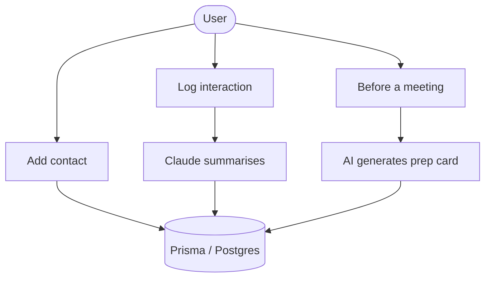

# Knowho 🤝

**Personal AI contact manager — remember the people who matter.**

GitHub: [sarahwangy/knowho](https://github.com/sarahwangy/knowho)

---

## Why I Built This

I kept forgetting details about people I care about — when I last spoke to them, what they were working on, small things that matter. I'd run into a friend and draw a blank on what we'd talked about last time, or miss a birthday I'd meant to remember.

Corporate CRMs are built for sales funnels, not friendships. I wanted something quiet and personal: a place to log a conversation after coffee, remember that someone's daughter just started university, or glance at key talking points before catching up with a mentor. Knowho is that tool — a private contact manager that helps me be a better friend and colleague by surfacing the right context at the right time.

---

## Features

- **Contact profiles** — name, where you met, one-line impression, and a flexible tag system (presets like `Friends`, `Work`, `Community`, plus custom tags)
- **Interaction timeline** — log notes after every conversation; the timeline stays in reverse chronological order so the most recent context is always on top
- **AI meeting prep card** — before you see someone, a card surfaces the last interaction summary, any upcoming important dates, and key talking points generated by Claude
- **Voice notes** — speak your post-meeting thoughts on the go; transcribed via Web Speech API with Whisper API as fallback (planned)
- **Birthday and important date reminders** — store birthdays, anniversaries, or any custom date; get an email digest before they arrive
- **Tag system** — group contacts by context (reading group, gym crew, neighbours) and filter your list instantly

---

## Architecture



---

## Tech Stack

| Layer | Technology |
|---|---|
| Framework | Next.js 14 (App Router) |
| Language | TypeScript |
| ORM | Prisma |
| Database | Vercel Postgres |
| Auth | NextAuth.js v5 — Google OAuth |
| AI | Claude Haiku (meeting prep + interaction structuring) |
| Voice (planned) | Whisper API (OpenAI) |
| Styling | Tailwind CSS + shadcn/ui |
| Deployment | Vercel |

---

## Status

**Active development — not fully deployed yet.**

The project is being built in three phases:

- **P0 (core)** — auth, contact profiles, interaction timeline, important dates (~14 days)
- **P1 (differentiation)** — AI meeting prep card, voice notes, friend share links (~8.5 days)
- **P2 (advanced)** — AI-structured interaction parsing, "going cold" reminders, email push via Resend (~8.5 days)

---

## Getting Started

### Prerequisites

- Node.js 18+
- A Vercel Postgres database (or local Postgres)
- Google OAuth credentials (for NextAuth)
- Anthropic API key (for Claude)

### Install and run locally

```bash
git clone https://github.com/sarahwangy/knowho.git
cd knowho
npm install
```

Copy the environment template and fill in your values:

```bash
cp .env.example .env.local
```

Required environment variables:

```
DATABASE_URL=
NEXTAUTH_SECRET=
GOOGLE_CLIENT_ID=
GOOGLE_CLIENT_SECRET=
ANTHROPIC_API_KEY=
```

Run database migrations and seed preset tags:

```bash
npx prisma migrate dev
npx prisma db seed
```

Start the development server:

```bash
npm run dev
```

Open [http://localhost:3000](http://localhost:3000).
