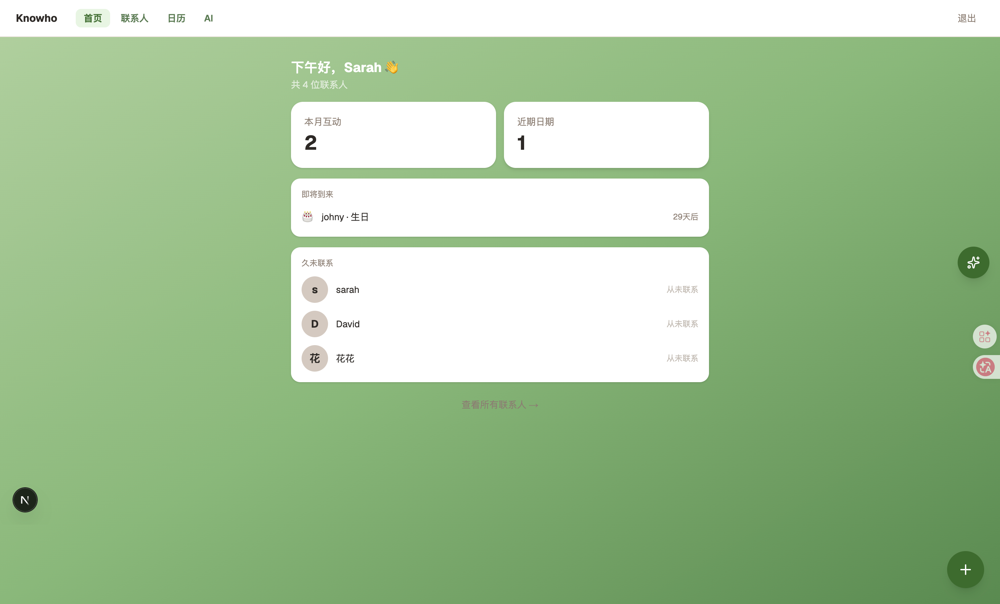
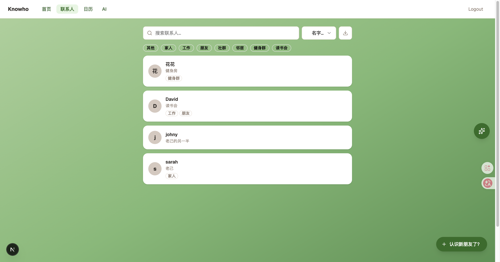
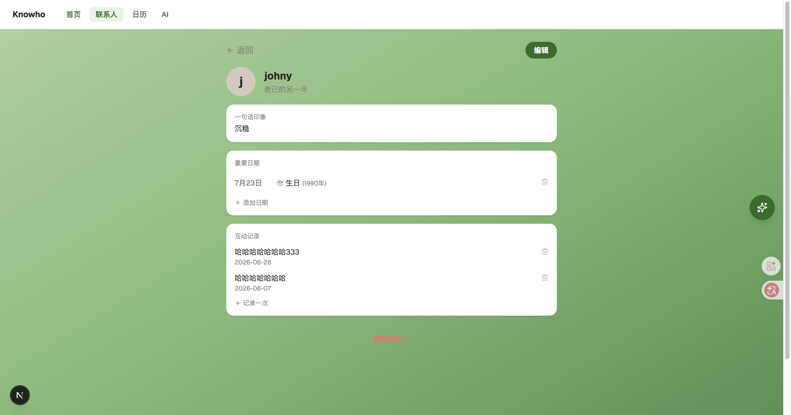
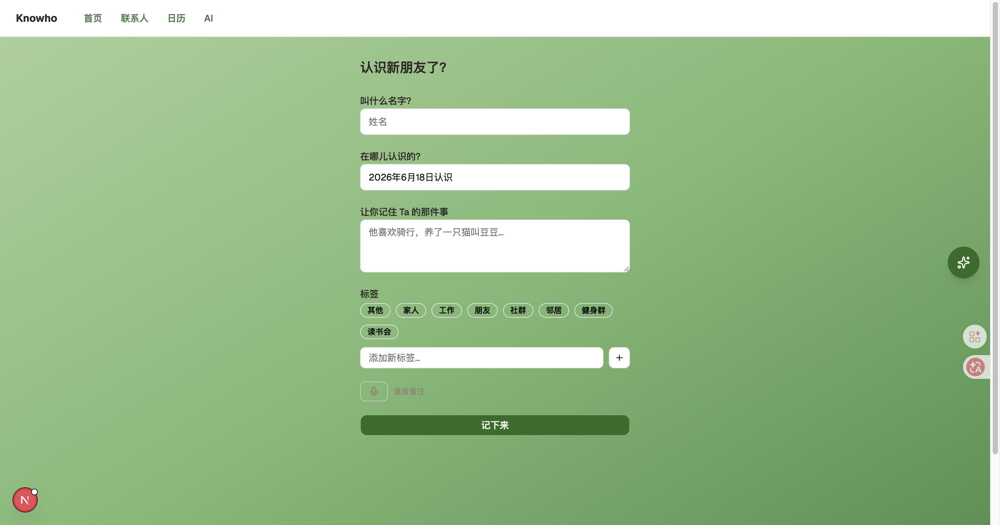
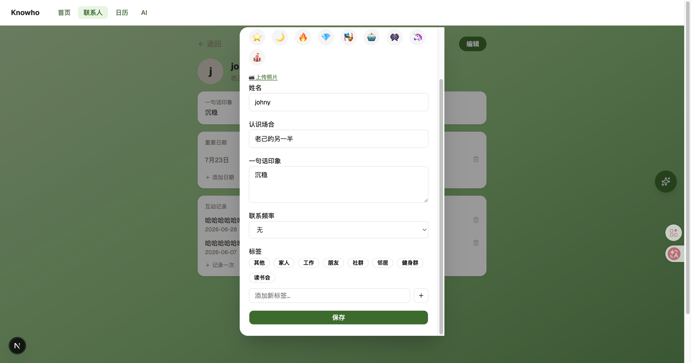
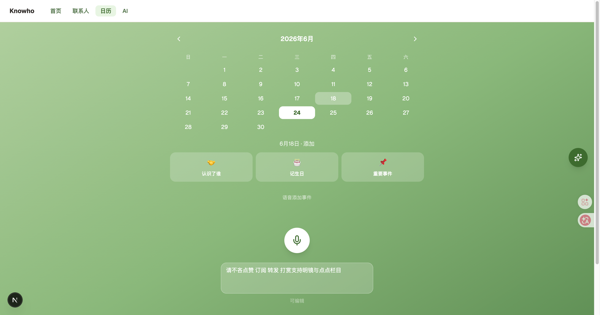
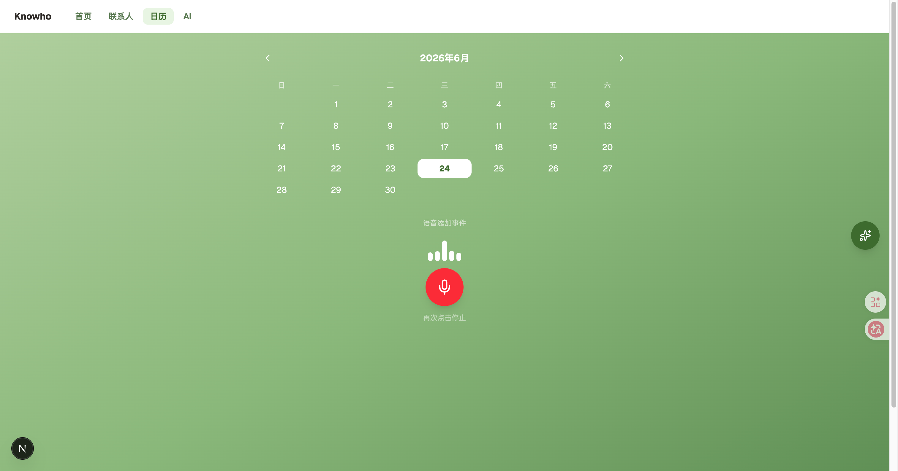
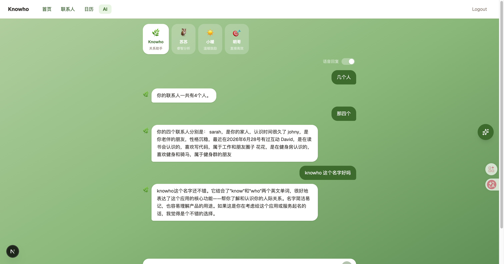
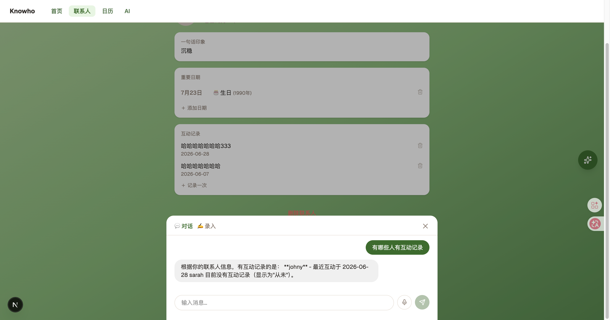
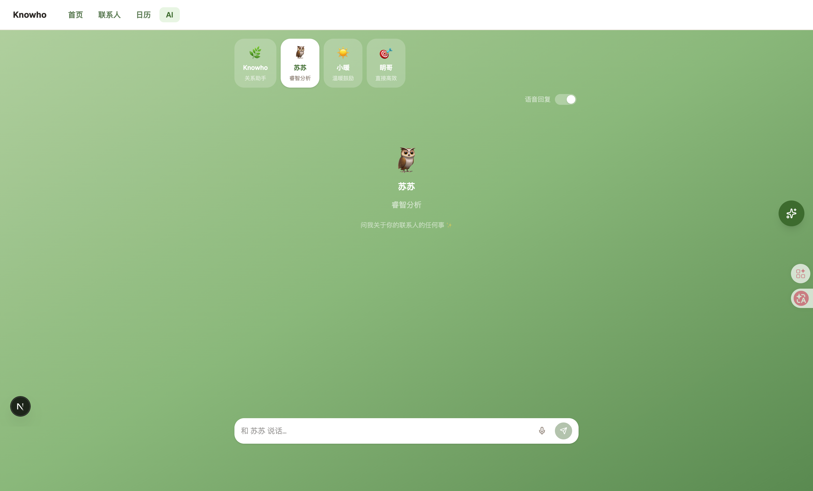

# Knowho 🤝

**Personal AI contact manager — remember the people who matter.**

🔗 **Live Demo**: [knowho.vercel.app](https://knowho.vercel.app)\
📝 **Read the Story**: [Medium](https://medium.com/@sarahwang9)\
🇨🇳 **中文文档**: [README_CN.md](./README_CN.md)

---


> **Note:** All data shown in the screenshots and demo is mock data created for testing purposes only. All contacts, interactions, and personal details are entirely fictional.

---

## Why I Built This

I kept forgetting details about people I care about — when I last spoke to them, what they were working on, small things that matter. I'd run into a friend and draw a blank on what we'd talked about last time, or miss a birthday I'd meant to remember.

Corporate CRMs are built for sales funnels, not friendships. I wanted something quiet and personal: a place to log a conversation after coffee, remember that someone's daughter just started university, or glance at key talking points before catching up with a mentor. Knowho is that tool — a private contact manager that helps me be a better friend and colleague by surfacing the right context at the right time.

---

## Features

### 🏠 Home

A personalised welcome screen that greets you by name and gives you a quick overview of upcoming birthdays and recent contacts — so you know who to reach out to today.



---

### 👥 Contact List

Browse all your contacts at a glance. Filter by tag (Friends, Work, Community, etc.) to find the right person instantly.



---

### 👤 Contact Detail

Each contact has a full profile: where you met, your first impression, tags, important dates, and a full interaction timeline in reverse chronological order. The most recent context is always on top.



---

### ✍️ Add New Contact

Quickly capture a new person — name, where you met, your initial impression, and tags. Voice input lets you speak your thoughts on the go.



---

### ✏️ Edit Contact

Update any detail at any time. Add new important dates, change tags, or revise your impression as your relationship evolves.



---

### 📅 Calendar

See all upcoming birthdays and important dates in a monthly calendar view. Add events by voice or manually, so you never miss a moment that matters.





---

### 🤖 AI Chat

Have a conversation with your contacts data. Ask the AI anything — who you haven't spoken to in a while, what you know about someone, or who shares a common interest. Each AI persona (Knowho, 苏苏, 小暖, 明哥) has a different tone.



---

### 🧠 Contact AI Analysis

Open any contact's profile and get an AI-generated relationship analysis — interaction patterns, suggested talking points, and relationship health score — powered by Claude.





---

## Architecture


---

## Tech Stack

| Layer | Technology |
|---|---|
| Framework | Next.js (App Router) |
| Language | TypeScript |
| ORM | Prisma |
| Database | Vercel Postgres |
| Auth | NextAuth.js v5 — Google OAuth |
| AI | Claude Haiku (meeting prep + chat) |
| Styling | Tailwind CSS + shadcn/ui |
| Deployment | Vercel |

---

## Getting Started

```bash
git clone https://github.com/sarahwangy/knowho.git
cd knowho
npm install
cp .env.example .env.local
npx prisma migrate dev
npm run dev
```

Required environment variables:

```
DATABASE_URL=
NEXTAUTH_SECRET=
GOOGLE_CLIENT_ID=
GOOGLE_CLIENT_SECRET=
ANTHROPIC_API_KEY=
```

Open [http://localhost:3000](http://localhost:3000).

---

## Roadmap

- [x] Contact profiles with tags and impressions
- [x] Interaction timeline (log notes after every conversation)
- [x] Birthday and important date reminders
- [x] Calendar view for upcoming dates
- [x] Voice input for adding contacts and events
- [x] AI chat — ask anything about your contacts
- [x] AI relationship analysis per contact
- [x] Multiple AI personas with different tones
- [x] Google OAuth login
- [ ] Email digest before upcoming birthdays
- [ ] "Going cold" reminders for contacts you haven't spoken to
- [ ] Friend share links — let a contact view their own card
- [ ] Mobile app (React Native)

---

## License

MIT
