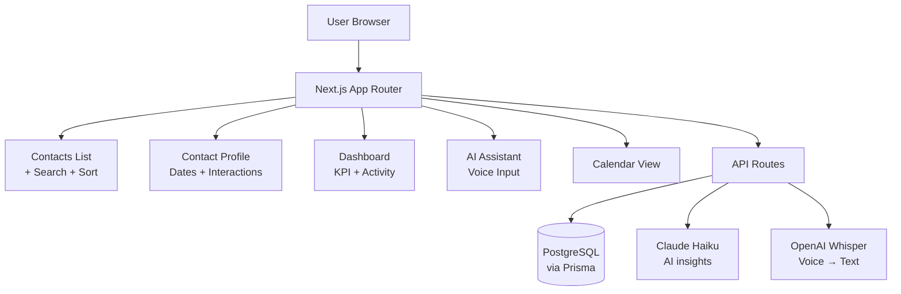
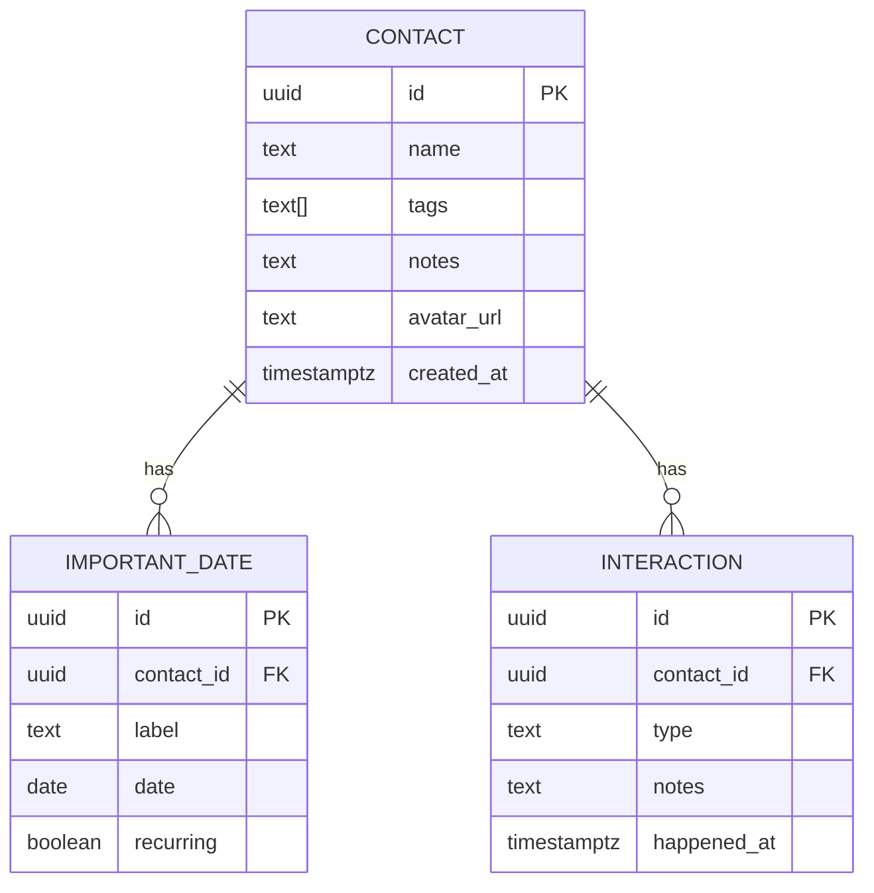
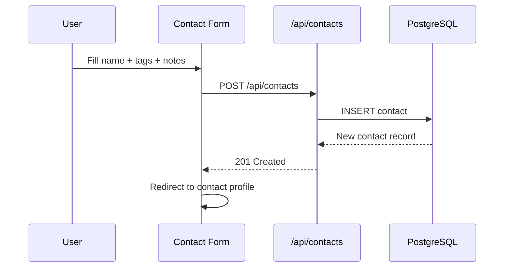
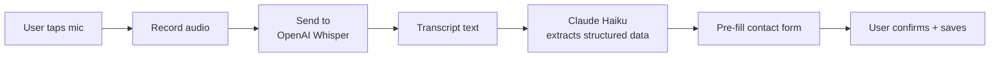
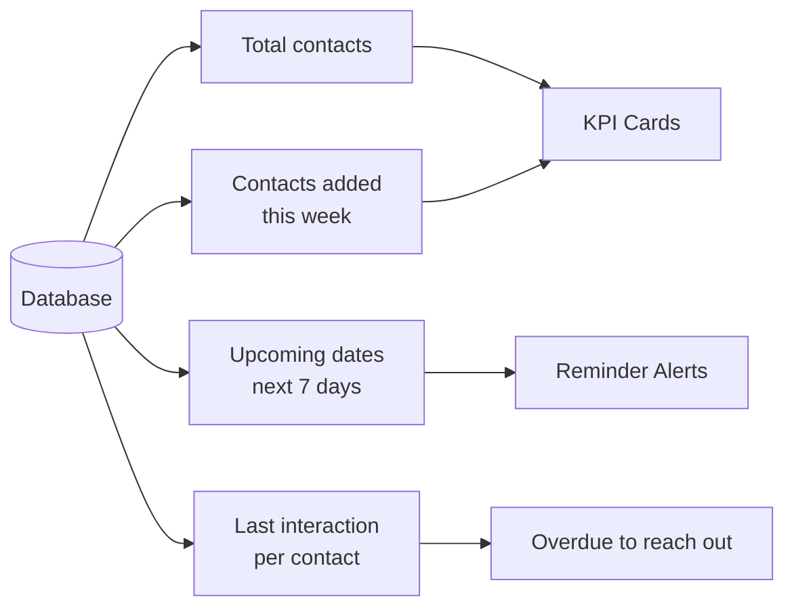

# Architecture Diagrams — Knowho

## System Architecture

```mermaid
graph TD
    User[User Browser] --> Next[Next.js App Router]
    
    Next --> Contacts[Contacts List\n+ Search + Sort]
    Next --> Profile[Contact Profile\nDates + Interactions]
    Next --> Dashboard[Dashboard\nKPI + Activity]
    Next --> AIAssist[AI Assistant\nVoice Input]
    Next --> Calendar[Calendar View]
    
    Next --> API[API Routes]
    API --> DB[(PostgreSQL\nvia Prisma)]
    API --> Claude[Claude Haiku\nAI insights]
    API --> Whisper[OpenAI Whisper\nVoice → Text]
```

## Data Model

```mermaid
erDiagram
    CONTACT {
        uuid id PK
        text name
        text[] tags
        text notes
        text avatar_url
        timestamptz created_at
    }
    IMPORTANT_DATE {
        uuid id PK
        uuid contact_id FK
        text label
        date date
        boolean recurring
    }
    INTERACTION {
        uuid id PK
        uuid contact_id FK
        text type
        text notes
        timestamptz happened_at
    }
    CONTACT ||--o{ IMPORTANT_DATE : has
    CONTACT ||--o{ INTERACTION : has
```

## Add Contact Flow

```mermaid
sequenceDiagram
    participant U as User
    participant UI as Contact Form
    participant API as /api/contacts
    participant DB as PostgreSQL

    U->>UI: Fill name + tags + notes
    UI->>API: POST /api/contacts
    API->>DB: INSERT contact
    DB-->>API: New contact record
    API-->>UI: 201 Created
    UI->>UI: Redirect to contact profile
```

## Voice Input Flow (AI Feature)

```mermaid
flowchart LR
    A[User taps mic] --> B[Record audio]
    B --> C[Send to\nOpenAI Whisper]
    C --> D[Transcript text]
    D --> E[Claude Haiku\nextracts structured data]
    E --> F[Pre-fill contact form]
    F --> G[User confirms + saves]
```

## Dashboard Metrics

```mermaid
graph LR
    DB[(Database)] --> A[Total contacts]
    DB --> B[Contacts added\nthis week]
    DB --> C[Upcoming dates\nnext 7 days]
    DB --> D[Last interaction\nper contact]
    
    A --> KPI[KPI Cards]
    B --> KPI
    C --> Alert[Reminder Alerts]
    D --> Stale[Overdue to reach out]
```
