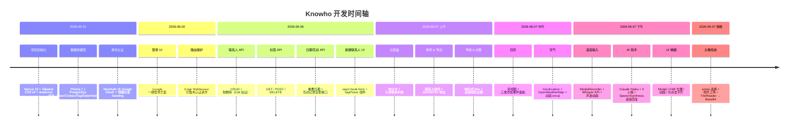

# Knowho 开发时间轴

## 表格总览

| 日期 | 阶段 | 解决的事件 / 功能 | 核心技术 |
|------|------|------------------|---------|
| 2026-05-31 | 项目初始化 | 创建 Next.js 项目；搭建 Prisma 数据库模型（User / Contact / Tag / ImportantDate / Interaction）；配置 NextAuth.js v5 Google OAuth；预置系统标签 | Next.js 15, Prisma 7, PostgreSQL, NextAuth v5, Tailwind CSS v4, shadcn/ui |
| 2026-06-02 | 认证层 | 实现登录页 UI（Google 一键登录）；添加 Edge 路由保护中间件，未登录自动跳转 | NextAuth v5 JWT 策略, Next.js Middleware, Edge Runtime |
| 2026-06-06 | 核心 API | 联系人 CRUD（GET/POST/PATCH/DELETE）；标签 CRUD；重要日期 API（POST/DELETE）；互动记录 API（GET/POST/DELETE）；新建联系人表单页（带 TagPicker 组件）；软删除防竞态（deleteMany 替代 delete） | REST API, Zod 验证, react-hook-form, shadcn Badge/Input/Label |
| 2026-06-07（上午）| 仪表盘 & 列表优化 | 首页仪表盘（总联系人数、本月互动、近期生日、久未联系列表）；联系人列表按姓名 / 最后互动时间排序；JSON / CSV 导出功能（下拉菜单） | Prisma 聚合查询, shadcn DropdownMenu/Select, CRLF CSV |
| 2026-06-07（上午）| 导航 & 主题 | 响应式 Nav（桌面顶部 / 移动底部）；全站森林绿色系（渐变背景 `from-[#b2d0a0]`，按钮 `#3d6b2e`）；JWT 策略修复 Edge Runtime 兼容问题 | Next.js App Router Layout, Tailwind 渐变, JWT |
| 2026-06-07（中午）| 日历 | 月视图日历网格；GET /api/calendar 聚合当月事件；每天可点击，点击后弹出三种添加事件面板（认识了谁 / 记生日 / 重要事件）；联系人搜索下拉 | 日期计算, Prisma 日历聚合 |
| 2026-06-07（中午）| 天气小组件 | 浏览器 Geolocation 获取坐标；服务端代理路由 /api/weather（持有 API Key，10 分钟缓存）；天气 emoji + 动画（☀️ pulse / 🌧️ drip / 🌫️ float）| OpenWeatherMap API, URL constructor（防 Key 日志泄露）, CSS @keyframes |
| 2026-06-07（下午）| 语音输入 | 可复用 MicButton 组件；MediaRecorder 录音（webm/mp4 fallback）；POST /api/voice/transcribe 发送音频至 Whisper；日历页语音框 + 5 柱声波动画 | OpenAI Whisper API, MediaRecorder API, CSS 动画 |
| 2026-06-07（下午）| AI 助手 | /api/ai/chat 支持 chat / record 两种模式；AiAssistant 浮动组件（挂载在全局 Layout）；专属 /ai 页面，4 个 AI 人格（Knowho 🌿 / 苏苏 🦉 / 小暖 ☀️ / 明哥 🎯）；语音回复（浏览器 SpeechSynthesis，零成本） | Anthropic Claude Haiku, Web Speech API (SpeechSynthesis), Streaming |
| 2026-06-07（下午）| UI 精打细磨 | Nav 加粗 + hover 高亮；AI FAB 移至右侧居中；编辑按钮改为圆角绿色；重要日期改为表格并按月日排序；编辑/添加日期弹窗改为居中 Modal；仪表盘统计卡可点击跳转；天气放大 + 动画 | Tailwind CSS v4, Modal 布局 |
| 2026-06-07（傍晚）| 头像系统 | Prisma `avatar String?` 字段 + 迁移；PATCH API 支持 avatar；ContactAvatar 展示组件（首字母 / emoji / base64 图片）；AvatarPicker（16 种 emoji + 照片上传 FileReader→base64）；集成至联系人详情、列表、仪表盘 | Prisma migrate, FileReader API, Base64, shadcn |

---

## 时间轴 Diagram

> 将上方 Mermaid 代码粘贴至 [mermaid.live](https://mermaid.live) 即可渲染为可视化图表。
